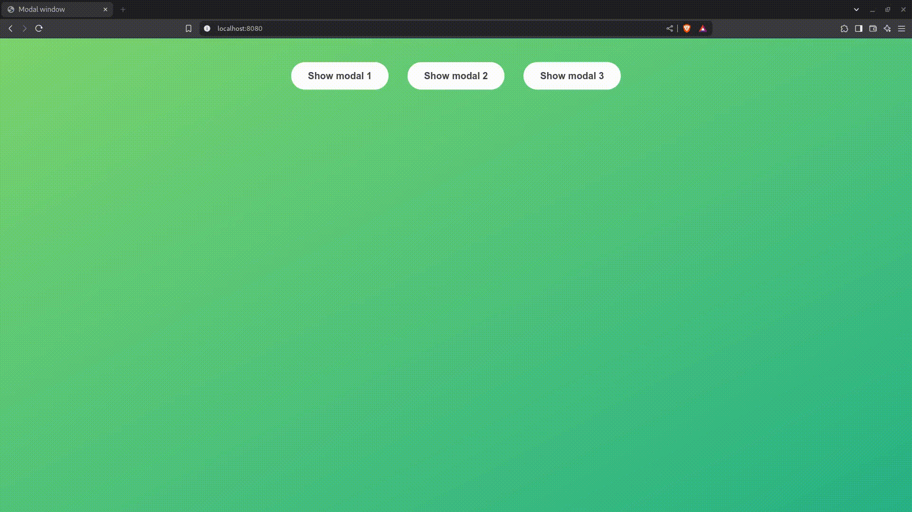
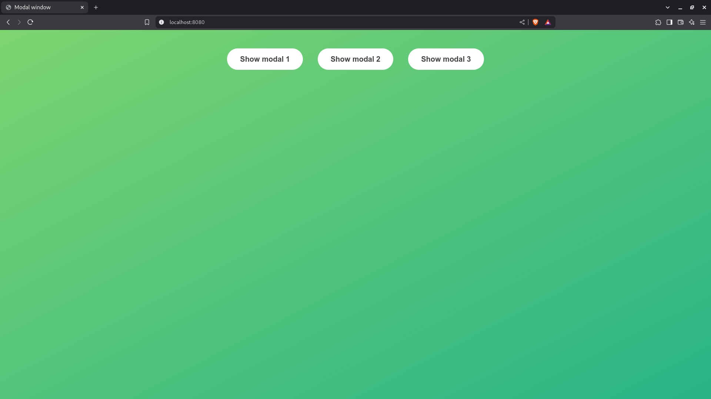
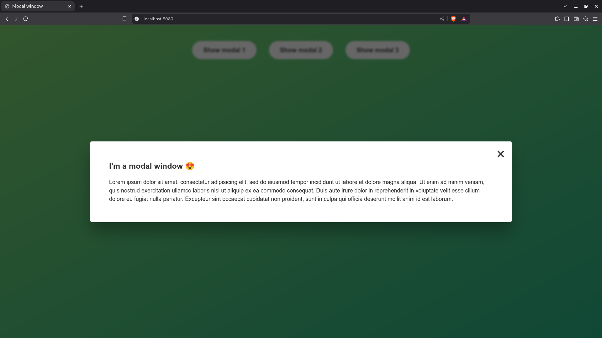

# Modal Window

## Motivation and improvements

The original project was implemented to practice DOM manipulation and event handling in JavaScript.

These are the improvements of my implementation:

1. I wrote the script in **TypeScript**
2. I have handled missing elements gracefully
3. I have applied some Clean Code techniques, such as using guard clauses and writing functions that do one thing
4. I have created a workflow for building and serving the app

## How it works

You can open the modal window by clicking any of the three buttons. Once the modal is open, you can close it by clicking the close button, clicking outside the modal, or by hitting the ESC key.

## Demo

  
  <em>Demo</em>

## Screenshots

  
  <em>Hidden modal<em>

  
  <em>Visible modal<em>

## DevDependencies

          

## Installation and usage

1. Clone or download this repository
2. Open it with VS Code
3. Run `npm install` to install dependencies
4. Run `npm run dev` to build
5. Run `npm serve` to serve
6. Click `Go Live` at the bottom left corner of the editor

## Source

This project is part of [The Complete JavaScript Course 2025: From Zero to Expert](https://www.udemy.com/course/the-complete-javascript-course/), by Jonas Schmedtmann.

The source code of the original project can be found at the [06-Modal](https://github.com/jonasschmedtmann/complete-javascript-course/tree/master/06-Modal) repository.

## License

The original project does not have an explicit license. However, the author explicitly states that this project may only be used for learning purposes or personal portfolio. **Do NOT use it to teach and do NOT claim it as your own product**.
